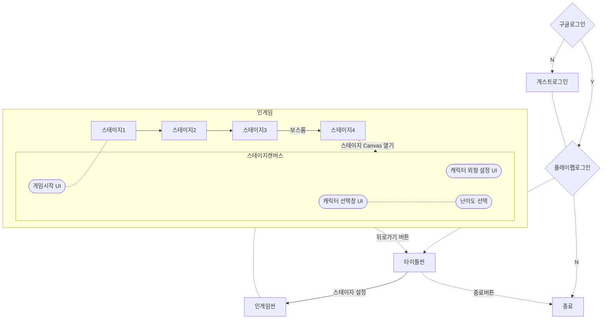

# Portfolio_Hermeki
## 게임명: Hermeki   
>장르 : 2D 어드밴처   
>플랫폼 : Mobile   
>제작의도 : 앙빅류 어드밴처 게임. 레벨 디자인에 중점을 두고 개발   

  

## 플로우차트

```mermaid
 flowchart TB

플레이팹{플레이팹로그인};
구글로그인{구글로그인};
타이틀씬;
구글로그인-.->|Y|플레이팹;
구글로그인-.->|N|게스트로그인;
게스트로그인-.-플레이팹;
플레이팹-.->|Y|타이틀씬;
플레이팹-.->|N|종료;

타이틀씬-->|스테이지 설정|인게임씬;
타이틀씬-.->|종료버튼|종료;
인게임씬-.-인게임;
subgraph 인게임
direction LR
  subgraph 스테이지캔버스
  direction LR
  캐릭터설정([캐릭터 외형 설정 UI]);
  게임시작([게임시작 UI]);
  캐릭터선택([캐릭터 선택창 UI]);
  캐릭터선택-.-레벨선택([난이도 선택]);  
end
게임시작-.-스테이지1;
스테이지1-->스테이지2-->스테이지3-->|보스룸|스테이지4-.->|스테이지 Canvas 열기|스테이지캔버스;
end
인게임-.->|뒤로가기 버튼|타이틀씬;
```
* * *
  

## 적용 기술   
### A* Path
>A* 알고리즘으로 AI 길찾기 구현.
